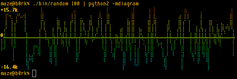
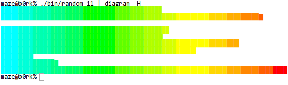
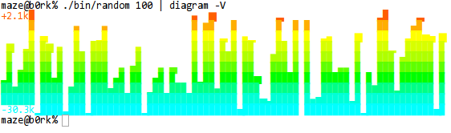
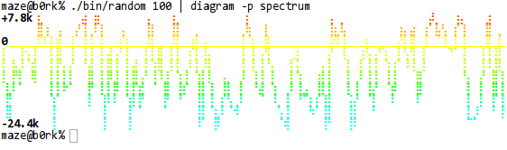
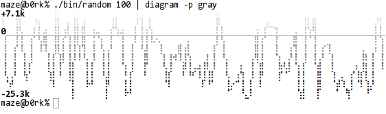
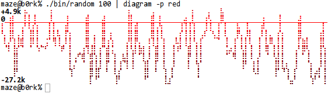
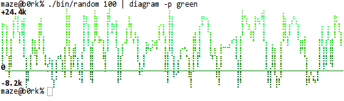
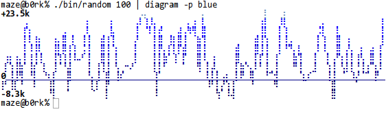

# diagram

Text mode diagrams using UTF-8 characters and fancy colors (using Python).

## Features

 * Axial graphs
 * Horizontal and vertical bar graphs
 * Supports both 3 bit (16 color) and 8 bit (256 color) mode colors with
   various pre-defined palettes (see below)
 * UTF-8 text graphics

## Installation

It's recommended to use pip to install/update.

To install:

    $ sudo pip install diagram

To update:

    $ sudo pip install -U diagram

## Examples

Pictures say more than a thousand words.

### Axis graph

### Horizontal bar graph

Drawing characters used:

    ▏ ▎ ▍ ▌ ▋ ▊ ▉ █

### Vertical bar graph

Drawing characters used:

    ▁ ▂ ▃ ▄ ▅ ▆ ▇ █

## Usage

Use `diagram --help` for documentation:

    usage: diagram [-h] [-G] [-H] [-V] [-a] [-A] [-c] [-C] [-l] [-L]
                   [-f function] [-p palette] [-x characters] [-y characters]
                   [-r] [-b] [-s SLEEP] [-i file] [-o file] [-e ENCODING]

    optional arguments:
      -h, --help            show this help message and exit

    optional drawing mode:
      -G, --graph           axis drawing mode (default)
      -H, --horizontal-bars
                            horizontal drawing mode
      -V, --vertical-bars   vertical drawing mode

    optional drawing arguments:
      -a, --axis            draw axis (default: yes)
      -A, --no-axis         don't draw axis
      -c, --color           use colors (default: yes)
      -C, --no-color        don't use colors
      -l, --legend          draw y-axis legend (default: yes)
      -L, --no-legend       don't draw y-axis legend
      -f function, --function function
                            curve manipulation function, use "help" for a list
      -p palette, --palette palette
                            palette name, use "help" for a list
      -x characters, --width characters
                            drawing width (default: auto)
      -y characters, --height characters
                            drawing height (default: auto)
      -r, --reverse         reverse draw graph

    optional input and output arguments:
      -b, --batch           batch mode (default: no)
      -k, --keys            input are key-value pairs (default: no) (1)
      -s SLEEP, --sleep SLEEP
                            batch poll sleep time (default: none)
      -i file, --input file
                            input file (default: stdin)
      -o file, --output file
                            output file (default: stdout)
      -e ENCODING, --encoding ENCODING
                            output encoding (default: auto)

    (1): only works for the horizontal bar graph, the first argument is the key
    and the second value is the data point.

### `--function ...`

The parameter can be just the function name or the function name with arguments,
for example:

    diagram -f log

or, with an argument:

    diagram -f log:e

#### log

Symmetrical logarithmic scale.

#### smooth

Smooth (and optionally differentiate) data with a Savitzky-Golay filter.

### `--palette ...`

#### default / spectrum

#### grey

#### red

#### green

#### blue

